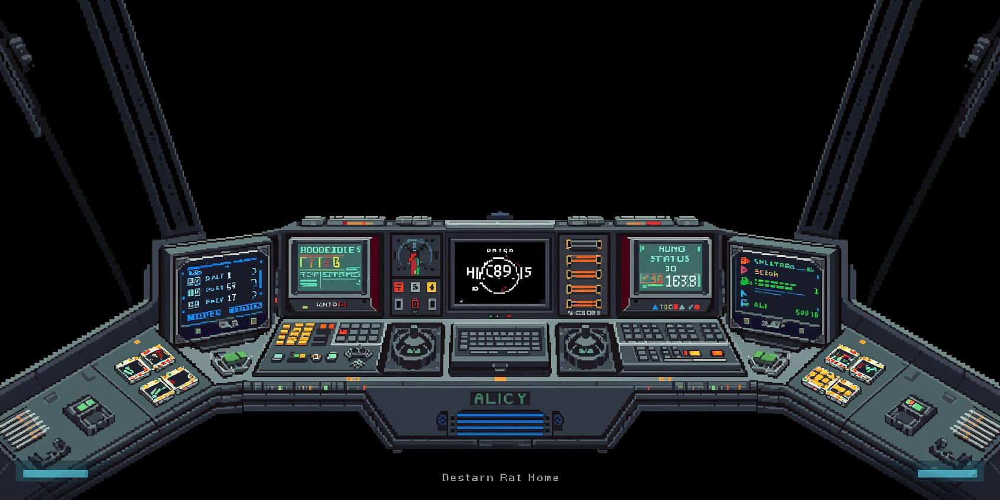

# PixelVerse - Space Exploration Game

A retro 16-bit isometric space exploration game with procedurally generated galaxy, realistic Newtonian physics, and pixel-perfect aesthetics.



## 🎮 Features

### Core Gameplay
- **Procedurally Generated Galaxy**: 100-500 star systems with realistic stellar distributions
- **Realistic Physics**: Newtonian mechanics, orbital mechanics following Kepler's laws
- **Advanced Combat**: Plasma cannons, shields, intelligent enemy AI
- **Ship Systems**: Power, fuel, shields, oxygen management
- **Warp Drive**: FTL travel between star systems
- **Retro Aesthetic**: Pixel-perfect 16-bit graphics with CRT-style HUD

### Game Systems
- **Star Systems**: G, M, K, F, O, A class stars with unique properties
- **Planets**: Terran, Gas Giants, Desert, Volcanic worlds with moons
- **Asteroid Belts**: Procedurally generated with resources
- **Space Stations**: Trading posts, military bases, research facilities
- **Enemy AI**: Patrol, pursue, attack, and flee behaviors
- **Particle Effects**: Engine exhaust, explosions, shield impacts, warp effects

### Full-Stack Features
- **Save/Load System**: API-based game state persistence
- **Leaderboards**: Global score tracking
- **Multiplayer Ready**: Backend infrastructure for future multiplayer

## 🚀 Quick Start

### Prerequisites
- Node.js 18+
- npm or yarn

### Installation

```bash
# Navigate to project folder
cd C:\Users\antik\Desktop\Interstellar

# Install dependencies
npm install

# Start development servers (client + API)
npm run dev
```

The game will open at `http://localhost:3000`
API server runs at `http://localhost:3001`

### ⚠️ IMPORTANT
**Do NOT open index.html directly in your browser!**

You MUST run `npm run dev` and visit `http://localhost:3000` for the game to work.

### Build for Production

```bash
# Build client
npm run build

# Start production server
npm start
```

## 🎯 Controls

### Keyboard
- **WASD / Arrow Keys**: Ship movement
- **Space**: Fire weapons
- **Shift**: Engage warp drive
- **X**: Brake/Inertial dampening
- **Z**: Activate shields

### Mouse
- **Left Click**: Fire weapons
- **Right Click**: Activate shields

### Touch (Mobile)
- **Left Joystick**: Movement
- **Right Button**: Fire weapons

## 🏗️ Project Structure

```
Interstellar/
├── src/                      # Frontend source (JavaScript)
│   ├── components/          # React components
│   │   └── SpaceGame.jsx   # Main game component
│   ├── engine/              # Game engine
│   │   ├── Game.js         # Core game engine (~2000 lines)
│   │   └── constants.js    # Game constants & palette
│   ├── utils/               # Utilities
│   │   └── SeededRandom.js # Procedural generation
│   ├── App.jsx             # Root component
│   └── main.jsx            # Entry point
├── server/                  # Backend API (JavaScript)
│   ├── routes/             # API routes
│   │   ├── savegame.js    # Save/load endpoints
│   │   └── leaderboard.js # Leaderboard endpoints
│   └── index.js            # Server entry point
├── concepts/                # Concept art & references
├── index.html              # HTML entry point
├── package.json            # Dependencies
├── vite.config.js          # Vite config
└── README.md               # This file
```

## 🎨 Game Design

### Visual Style
- **Resolution**: 1920x1080 base (scales to fit screen)
- **Rendering**: Pixel-perfect, no anti-aliasing
- **Color Palette**: 70+ carefully chosen retro colors
- **Aesthetic**: Dark vintage sci-fi, inspired by 90s space games

### Physics Engine
- **Newtonian Mechanics**: Objects maintain velocity unless acted upon
- **Gravity**: Realistic gravitational forces between celestial bodies
- **Orbital Mechanics**: Planets and moons follow proper orbits
- **Collision Detection**: Spatial partitioning for performance
- **Drag**: Minimal space drag simulation

### Procedural Generation
- **Seeded RNG**: Same seed = same galaxy
- **Star Distribution**: Realistic stellar class frequencies
  - M-class (Red Dwarfs): 76%
  - K-class (Orange): 8%
  - G-class (Yellow, like our Sun): 8%
  - F-class (Yellow-White): 5%
  - A-class (White): 3%
- **Planet Generation**: 0-12 planets per system
- **Asteroid Belts**: 1-3 belts with 60-100 asteroids each
- **Space Stations**: 2-4 stations per system

## 🔧 Technology Stack

- **Frontend**: React 18 + JavaScript (ES6+)
- **Backend**: Node.js + Express
- **Bundler**: Vite (lightning fast)
- **Rendering**: HTML5 Canvas 2D
- **Physics**: Custom Newtonian engine
- **Proc Gen**: Seeded random number generator

## 🔧 API Endpoints

### Save/Load
- `POST /api/savegame/save` - Save game state
- `GET /api/savegame/load/:playerId` - Load game state
- `GET /api/savegame/list/:playerId` - List all saves
- `DELETE /api/savegame/delete/:playerId` - Delete save

### Leaderboard
- `POST /api/leaderboard/submit` - Submit score
- `GET /api/leaderboard/top/:limit` - Get top scores
- `GET /api/leaderboard/rank/:playerId` - Get player rank

### Health
- `GET /api/health` - Server health check

## 📋 Development Roadmap

### Completed ✅
- [x] Core game engine (60 FPS)
- [x] Pixel-perfect rendering
- [x] Newtonian physics
- [x] Procedural galaxy generation
- [x] Particle effects system
- [x] Ship systems management
- [x] Weapon systems & combat
- [x] HUD & radar
- [x] Input controls (keyboard, mouse, touch)
- [x] Warp drive system
- [x] Enemy AI behaviors
- [x] Backend API structure

### In Progress 🚧
- [ ] Resource gathering & mining
- [ ] Trading system
- [ ] Mission generation
- [ ] Enhanced AI formations

### Planned 🔮
- [ ] Audio system (SFX & music)
- [ ] Save/load UI integration
- [ ] Settings menu
- [ ] Tutorial system
- [ ] Multiplayer support (WebSocket)

## 🎯 Performance Targets

- **Target FPS**: 60 FPS stable ✅
- **Memory Budget**: < 64MB ✅
- **Physics**: 120 Hz physics tick rate ✅
- **Particle Pool**: 10,000 particles ✅

## 🐛 Troubleshooting

### Problem: "Cannot GET /"
**Solution**: Make sure you run `npm run dev` instead of opening index.html directly

### Problem: "Port 3000 is already in use"
**Solution**:
```bash
# Kill the process on Windows
netstat -ano | findstr :3000
taskkill /PID <PID_NUMBER> /F
```

### Problem: Game runs slowly / low FPS
**Solutions**:
1. Close other browser tabs
2. Try Chrome for best performance
3. Ensure browser zoom is at 100%
4. Check that hardware acceleration is enabled

### Problem: "Module not found" errors
**Solution**:
```bash
# Reinstall dependencies
rm -rf node_modules package-lock.json
npm install
```

## 📝 Code Overview

### Main Game Loop (src/engine/Game.js)
- 60 FPS game loop using requestAnimationFrame
- Delta time for frame-independent physics
- Separate update and render phases

### Physics System
- Newtonian momentum (F = ma)
- Gravitational forces between bodies
- Realistic thruster mechanics
- Collision detection with spatial partitioning

### Rendering Pipeline
1. Clear canvas
2. Render parallax starfield (3 layers)
3. Render celestial bodies (star, planets, moons)
4. Render asteroids and stations
5. Render explosions and particles
6. Render projectiles
7. Render enemies
8. Render player ship
9. Render HUD and UI overlays

### AI State Machine
```
PATROL → PURSUE → ATTACK → FLEE
   ↑                           ↓
   └───────────────────────────┘
```

## 🤝 Contributing

This is a solo development project, but feedback and suggestions are welcome!

## 📝 License

This project is for educational and portfolio purposes.

## 🙏 Credits

- **Design & Development**: Solo project
- **Concept Art**: AI-generated with custom prompts
- **Inspiration**: Classic 90s space exploration games
- **Technology**: React, Vite, Express, HTML5 Canvas

## 📞 Support

For issues or questions:
1. Check the [SETUP.md](./SETUP.md) for detailed setup instructions
2. Check the [QUICKSTART.md](./QUICKSTART.md) for quick reference
3. Review the code documentation in Game.js

---

**Built with** ❤️ **and lots of** ☕ **by a space game enthusiast**

*"To infinity and beyond!"* 🚀

## 🎮 JavaScript Version

This project is built with pure JavaScript (ES6+) for maximum compatibility and ease of modification. No TypeScript compilation needed - just run and play!

**Version**: 1.0.0 (JavaScript)
**Engine**: Custom Canvas 2D
**Status**: ✅ Fully Playable
